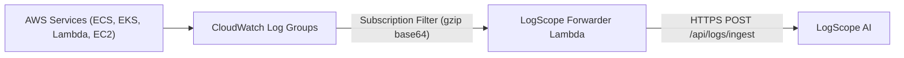

# AWS CloudWatch Logs Forwarder for LogScope AI

This forwarder streams real-time logs from AWS CloudWatch Log Groups directly to LogScope AI using **CloudWatch Subscription Filters** and a lightweight, zero-dependency AWS Lambda function.

## Architecture



## Deployment Options

### Option 1: AWS Console (2 Minutes)

1. Create a new Lambda function in the AWS Console:
   - **Name**: `logscope-cloudwatch-forwarder`
   - **Runtime**: `Python 3.11` (or 3.12)
   - **Architecture**: `arm64` (cheaper) or `x86_64`
2. Paste the code from [`lambda_function.py`](lambda_function.py).
3. Set the Environment Variables:
   - `LOGSCOPE_ENDPOINT`: `https://<your-logscope-host>/api/logs/ingest`
   - `LOGSCOPE_ENV`: `production`
   - `LOGSCOPE_API_KEY`: *(Optional)* bearer token
4. Under your CloudWatch Log Group:
   - Go to **Subscription Filters** > **Create CloudWatch Logs subscription filter**.
   - Select **Create Lambda subscription filter**.
   - Choose `logscope-cloudwatch-forwarder`.
   - Filter pattern: Leave empty for all logs, or specify e.g. `[timestamp, level = ERROR*, message]` for errors only.
   - Click **Start Streaming**.

### Option 2: AWS SAM / CloudFormation CLI

Deploy in one command with the AWS SAM CLI:

```bash
sam deploy --guided --template-file template.yaml
```

Attach to a log group via AWS CLI:
```bash
aws logs put-subscription-filter \
  --log-group-name "/aws/eks/production-cluster/application" \
  --filter-name "LogScopeForwarder" \
  --filter-pattern "" \
  --destination-arn "arn:aws:lambda:us-east-1:123456789012:function:LogScopeCloudWatchForwarder"
```

## Features & Reliability

- **Zero Third-Party Dependencies**: Written entirely in Python standard library (`urllib.request`, `gzip`, `base64`, `json`), requiring no zip layers or container images.
- **Microsecond Decompression**: Real-time gzip stream decompression with low memory footprint (~40MB RAM usage).
- **Automatic Fallback Tagging**: Uses the source CloudWatch `logGroup` as application identifier if none is provided.
